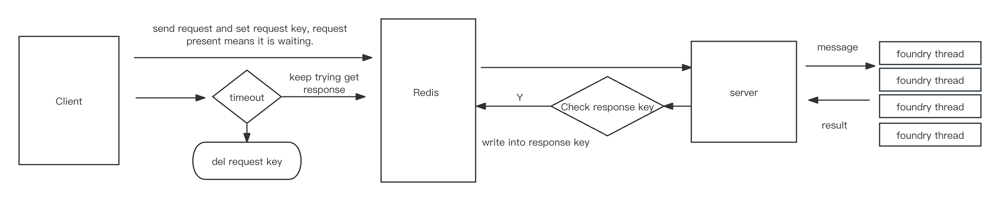

# Batch Foundry

**Batch Foundry is dedicated to facilitating batch processing tests using the Foundry testing framework. This repository aims to streamline and automate the testing process for developers, leveraging Foundry's capabilities to ensure code integrity and functionality across multiple batches simultaneously.**

## Requirements
|   Requirement       |     Github / Site   |   Doc       |
|----------|----------|----------|
| Foundry-rs | https://github.com/foundry-rs/foundry     | https://book.getfoundry.sh/     |
| Rust    | https://www.rust-lang.org/     | https://docs.rs/     |
|Redis| https://redis.io/ |  https://redis.io/docs/ |
| * Docker    | https://www.docker.com/     | https://hub.docker.com/     |


> marked with * means it is not must required 

## Preparation

Firstly, should setup the fourndry environment, we can easily get it from the command:

``` 
curl -L https://foundry.paradigm.xyz | sh && ~/.foundry/bin/foundryup
```

And in the root path, we should run this comamnd to init for foundry environment.

```
forge init --force
```

Change the `src` path in `foundry.toml` to `contracts`, beacause it is conflicted with cargo/rust src directory.

## Command Help

Directly run `cargo run`, we can see the help information below:

```
Usage: judger <COMMAND>

Commands:
  server  Start the server
  client  Send a request to the redis and receive result
  help    Print this message or the help of the given subcommand(s)

Options:
  -h, --help     Print help
  -V, --version  Print version
```

There are two subcommands, run `cargo run server --help`:

```
Start the server

Usage: judger server [OPTIONS]

Options:
  -t, --thread-num <thread-num>
          How many threads do you want [default: 5]
  -r, --redis-host <redis-host>
          Redis server [default: 127.0.0.1]
  -p, --redis-prefix <redis-prefix>
          Prefix of the redis operations [default: smc-open-solidity-judge]
  -d, --worker-dir <worker-dir>
          The default work directory of the foundry env [default: tmp/worker]
  -n, --redis-list-name <redis-list-name>
          Redis list name [default: test]
  -h, --help
          Print help
```

run `cargo run client --help`:

```
Send a request to the redis and receive result

Usage: judger client [OPTIONS]

Options:
  -d, --directory <directory>        Root dir of the files (env: DIRECTORY) [default: usercode]
  -n, --question-no <question-no>    Questino number of the input
  -v, --solc-version <solc-version>  Solc version selected (env: SOLC_VERSION) [default: 0.8.20]
  -j, --job-id <job-id>              Job id offered (env: JOB_ID)
  -t, --timeout <timeout>            Timeout in secs (env: TIMEOUT) [default: 5]
  -h, --help                         Print help
```

## Flowchart




## Docker env

```shell
sh script/pack_rust_src.sh && docker build -t <image_name> docker/foundry
```

If the installation does not run as expected, you can try proxx, but you should run the build in the host network, otherwise the process cannot access your proxy.

```shell
sh script/pack_rust_src.sh && docker build -t <image_name> --network host --build-arg http_proxy=http://<your proxy>:<your port> --build-arg https_proxy=http://http://<your proxy>:<your port> docker/foundry
```

We have make the alias in the dockerfile, so you can run `server/client`, it represents for `judger server/judger client`

```shell
docker run -t <image_name> server
```